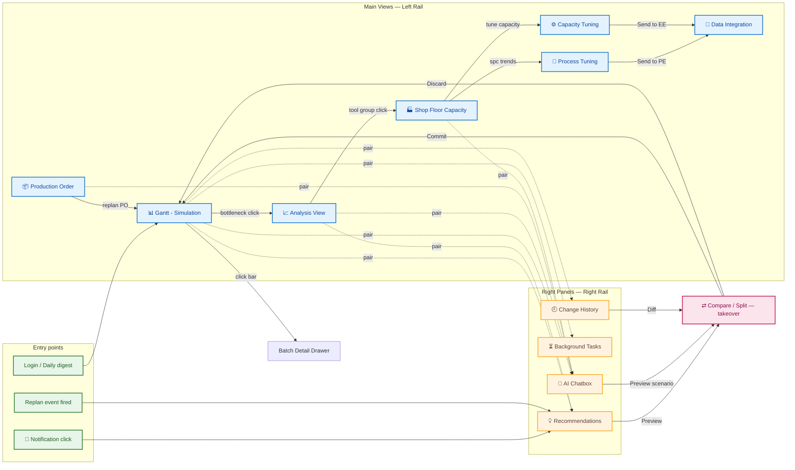
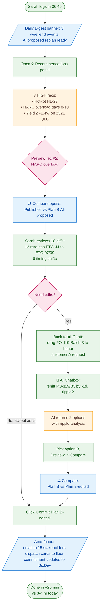
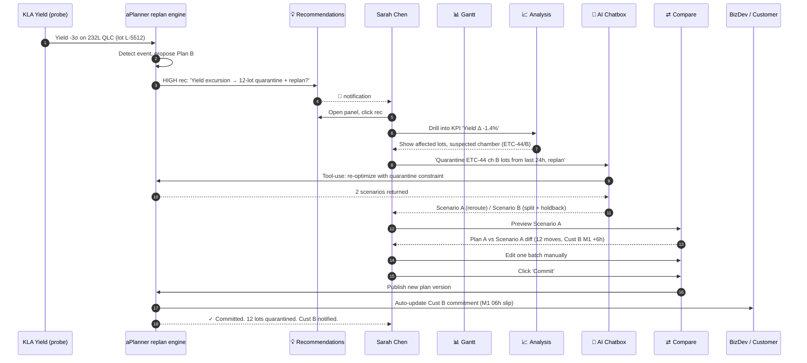
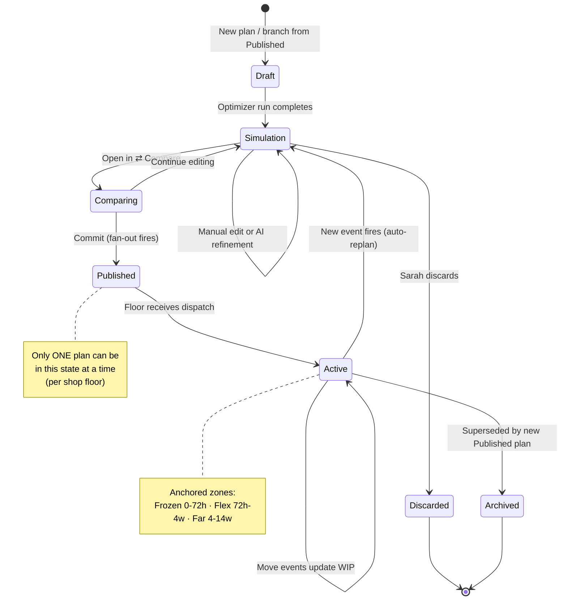
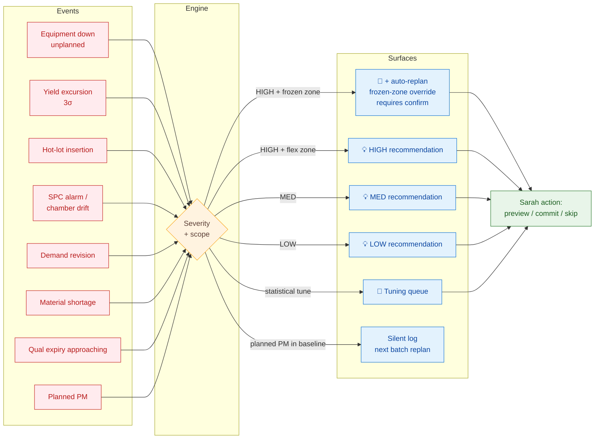

# Dynamic Schedule — Screen Flow Diagrams

> Mermaid screen-flow and state diagrams showing how Sarah (Senior Production Planner) moves between the views during typical Dynamic Scheduling tasks. Companion to [README.md](README.md), [01-main-views.md](01-main-views.md), [02-right-panels.md](02-right-panels.md).
>
> **Date**: 2026-05-25 · **Status**: Draft v1

---

## 1. Top-level navigation graph

How the views relate. Main views (left rail) are independent of right panels (right rail) — Sarah can pair any main view with any right panel — except **Compare / Split**, which takes over the workspace.



---

## 2. Monday-morning flow — "what happened over the weekend?"

Sarah arrives at 6:45 am. The system already replanned overnight on three events; she reviews, edits, commits.



---

## 3. Mid-day yield excursion replan

A 232L QLC yield drop fires at probe. The system raises a HIGH recommendation; Sarah investigates and replans.



---

## 4. Hot-lot insertion flow

A customer escalation arrives. Sarah inserts a hot lot directly on the Gantt with ripple preview.

```mermaid
flowchart TD
    classDef sarah fill:#E8F5E9,stroke:#2E7D32,color:#1B5E20
    classDef sys fill:#E3F2FD,stroke:#1976D2,color:#0D47A1
    classDef ai fill:#FFF3E0,stroke:#F9A825,color:#5D4037
    classDef decide fill:#FCE4EC,stroke:#C2185B,color:#880E4F

    Trigger([Customer A escalates HL-22<br/>via Account Mgmt → Sarah]):::sarah
    OpenPO[Open 📦 Production Order]:::sarah
    FindPO[Find PO-2025-118<br/>mark lot HL-22 as ★HOT P1]:::sarah
    BackGantt[Switch to 📊 Gantt]:::sarah
    DragHot[Drag HL-22 to target slot<br/>before 06-01 milestone]:::sarah
    Ripple[/Real-time ripple preview:<br/>3 downstream lots shift +18h<br/>1 commitment at risk/]:::sys
    OK{Ripple acceptable?}:::decide
    AskAI[🤖 AI: 'minimize impact<br/>of inserting HL-22 before 06-01']:::sarah
    Suggest[AI suggests:<br/>insert HL-22 + bump PO-120/B2 by -1d<br/>(idle capacity available on day -1)]:::ai
    PreviewB[⇄ Compare:<br/>preview AI plan]:::sys
    Confirm[Click 'Commit']:::sarah
    Fanout[/Notify Cust A + floor + BizDev<br/>HL-22 confirmed before 06-01/]:::sys
    History[🕘 History entry:<br/>'06:42 commit · Sarah · Hot lot HL-22']:::sys
    Done([Done ~8 min]):::sarah

    Trigger --> OpenPO --> FindPO --> BackGantt --> DragHot --> Ripple --> OK
    OK -- Yes --> Confirm
    OK -- No --> AskAI --> Suggest --> PreviewB --> Confirm
    Confirm --> Fanout --> History --> Done
```

---

## 5. Process Tuning workflow

AI detects HARC etch consistently running faster than spec. Sarah reviews evidence, accepts the tune, and sends the package to Process Engineering.

```mermaid
flowchart LR
    classDef ai fill:#FFF3E0,stroke:#F9A825,color:#5D4037
    classDef sarah fill:#E8F5E9,stroke:#2E7D32,color:#1B5E20
    classDef sys fill:#E3F2FD,stroke:#1976D2,color:#0D47A1
    classDef pe fill:#F3E5F5,stroke:#7B1FA2,color:#4A148C

    SPC[/SPC stream: HARC R-QLC-CH<br/>median 31.2 min vs spec 34 min<br/>n=412, 96% confidence/]:::ai
    Detect[Auto-detect: out of control<br/>raise SG-014]:::ai
    Notify[🔔 badge on 🔧 Process Tuning]:::sys
    Open[Sarah opens 🔧 Process Tuning]:::sarah
    Review[Review SG-014:<br/>SPC chart, schedule impact<br/>+520 wafer-passes/wk freed,<br/>Cust B M1 -12h]:::sarah
    Decide{Accept?}:::sarah
    Accept[Click 'Accept tune']:::sarah
    Apply[/System applies tune<br/>to current Plan A simulation/]:::sys
    Send[Click 'Send evidence to PE']:::sarah
    Pkg[/Evidence package:<br/>SPC run chart,<br/>control limits,<br/>schedule impact analysis/]:::sys
    PE[Process Engineer<br/>review task created]:::pe
    Confirm{PE approves?}:::pe
    Spec[Spec updated:<br/>R-QLC-CH process time 31.2 min]:::pe
    Reject[Tune marked rejected<br/>plan reverts to spec value]:::sys

    SPC --> Detect --> Notify --> Open --> Review --> Decide
    Decide -- Yes --> Accept --> Apply --> Send --> Pkg --> PE --> Confirm
    Confirm -- Yes --> Spec
    Confirm -- No --> Reject
    Decide -- No --> Reject
```



---

## 6. Plan version state diagram

The lifecycle of a plan. Multiple simulations can exist in parallel; only one is _Published_ at a time.



---

## 7. Event → response routing

Which events trigger which UI surface. Keeps Sarah in control without overwhelming her.



---

## 8. How to read these diagrams

- **Solid arrows** = mandatory transitions or data flow
- **Dotted arrows** (`-.->`) = optional pairings (e.g. any main view can pair with any right panel)
- **Color coding**:
  - 🟦 Blue = system / UI surface
  - 🟩 Green = Sarah's action
  - 🟧 Orange = AI / engine
  - 🟪 Purple = cross-team handoff (Process Eng, Equipment Eng, BizDev)
  - 🟥 Pink = decision point / takeover view
- All flows assume the **anchored-replan** stability model (frozen 0–72h · flex 72h–4w · far 4–14w) from [T14 Concept §5 Pillar A](../../ideation/T14-concept-dynamic-schedule.md#pillar-a--living-mps-generation-continuous-re-plan-engine).

---

## 9. Open questions for flow validation

1. **Daily digest entry point** — banner on first login, or separate "Inbox" surface? Diagram 2 assumes banner.
2. **AI Chat vs Recommendations overlap** — when does the AI proactively push to Recs vs wait to be asked in Chat? Severity matters; cadence is the open question.
3. **Frozen-zone override UX** — should a high-severity event in the frozen zone _auto-apply_ with banner-after, or _always require_ explicit Sarah confirm? Diagram 7 assumes the latter.
4. **Cross-team async** — when Sarah sends a tune to PE (diagram 5), does she keep working in the same simulation, or does the plan branch? Diagram 5 assumes simulation continues; PE approval back-merges later.
5. **Multi-event coincidence** — if 3 high-severity events fire within 10 minutes, do we batch into one replan recommendation or surface three? Diagram 7 lacks this nuance.

---

_Diagrams are illustrative and tied to T14 v1. Update alongside the concept doc as flows are validated with real planners._
